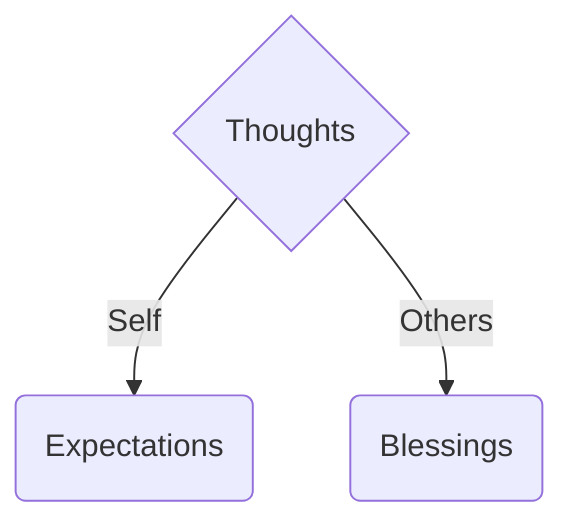

> If not already read, I would suggest reading my previous related article on [events and the impact of our thoughts on the eventuality](/_posts/life/2024-01-04-Knowing-a-little-more-about-the-unpredictable.md)

## What am I even talking about?
Eventuality as I define it is anything that happens, mainly to you. With you as the subject, target, protagonist, all of it. It may or may not even apply to others as well but that is something you can ponder for yourself later.
Okay, so anything that happens to you - as they say it happens for a reason. what reason? that is something you get to know from the outcomes/side-effects. But that I do not completely agree with. Any rational person will deduce that any action has it's cause and the direction of time it universal. meaning there has to be rules that govern any happenstance. humanity has been trying to study the same under the field of science since centuries.

### Humans really want to be able to predict the future
Newton believed if you knew the current state of all matter in the universe, you can predict the next frame of universal animation. Chemistry seemed predictable, physics seemed predictable, maths was predictable, but biology? there were always things in biology that were unexplainable and predictable. So when I say predictable, I mean that things happen as expected once we know something happens in a certain way. Simply put there is no true randomness involved. But these sciences were moving on independently trying to solve their own problems.\
After a few decades when we were able to look closer at matter, we found out about the quantum world. Facts like light existed as wave and particle at the same time. Then found out all matter turns out to be having a wavelength. String theory... so on and on. Anyway we found out a true reproducible method of randomness, quantum experiments.

But wait, if the fundamental forces of nature are in quantum states, doesn't it mean all of nature itself is proven unpredictable, yes and no. There are general large scale systems that are predictable and we know how, and then there are chaotic systems which depend on the initial conditions so much that they are extremely sensitive and almost unpredictable. Life is a little more than chaotic. I am sorry, but the science in current year has not reached that level of understanding that I can explain further why, but for the sake of this article from now - consider that life, specifically eventuality is a quantum phenomenon. As in all eventualities exists simultaneously in a superposition until the probabilities rule out every eventuality and the events occur.

## Why am I talking about all this again?
So as explained before we have been trying to know how things happen in this kinda chaotic system. There have to be still patterns that can help us at least narrow down the events and their possibilities. I do not claim to know these rules, nor have lived a long life yet to have that much wisdom. But by trying to identify these patterns since the last decade of my life seriously, I have narrowed down one possible hypothesis that logically makes all sense.

## Belief
> From here on, whatever I'm talking about is strictly my on personal beliefs and I do not endorse everyone to believe in it, unless they feel like so themselves.

I believe in karma. and any sane person should irrespective of religion in some form or another. Life is a game, and game theory implies us humans have to work together for the greater good.

So, let's dive into what I believe in -

$$
\text{Eventuality} \propto \text{Karma} + \text{Karma }_0
$$

Here $\text{Karma}$ and $\text{Karma}_0$ are two different entities completely. \
Karma as we know it widely, is action, deed or any work done. But I believe there is more to it. Just doing work/taking action does not get one to their goal. The right mindset is equally important and that is where thoughts come into picture. Thoughts are the ultimate power. As rightly said - thoughts become words, words become action and action leads one to success. But what to think and how to think?

Thoughts can be of mainly 2 types based on subject. Either one thinks of themselves, or thinks of others at a time.

- When one thinks anything related to personal outcome, that falls into expectations. And as we already discussed in my [past](/_posts/life/2024-01-04-Knowing-a-little-more-about-the-unpredictable.md) blog, expectations collapse the superposition timeline, or you can say simply reduce the probability of that event happening. In mathematical terms, it is inversely proportional to the outcome of the action.
- When one thinks anything about others, that is blessing. If we think good about others, that is positive blessing for them, and if we think bad about them, that is negative blessing (curse). This is directly proportional to the outcome, blessings help and curses do not.

-----------

$$
\text{Karma} \propto {\text{Action}} * \frac{\text{Blessing}}{\text{Expectation}} + {\text{Luck}}
$$

-----------

### Key points
1. Action is supreme. Doing good amplifies you karma directly and is directly under your control. This is the scoring subject, where one should not at all fail.
2. Blessings are not in our direct control. They depends on how other's perceive you, or you can also say, how *you* make *them* perceive *you*.
3. Expectations are under direct control. But it's the most difficult trait to master. Our brain is hardwired in a way that we expect outcomes. But the needle is too sensitive and we either fall into overconfidence or no confidence.
4. With these parameters, your life depends on others, and other's lives depend on your's. Or more accurately how they feel of you and how you feel of them.
5. These factors are only true if felt from within. These are not artificial factors, which they quite easily seem like so. We love things in our control, but to be very honest we are not in control. You cannot just hate someone without reason and expect bad things to happen, and same way you cannot expect to give favor and get good blessings, or I should say *expect* good blessings. It won't work.
6. As always luck adds on to whatever be the other factors and signifies true randomness of the universe, as the system does not only involve humans, but a lot of other matter as well.

-----------

$$
\text{Karma }_0 = {\text{Initial Conditions}} * Sanskar
$$

-----------
Here $\text{Karma}_0$ represents every aspect of you that you are from within. Inherent traits, skills you are good at, your body, your brain, your grasping power, your IQ, your surroundings, where you were born, your parents, how you were raised, and a lot more and not limited to known factors. Unknown factors like your past lives (if you believe in that), your overall karma in your past life, karma of people around you etc.

## Conclusion

Expanding Karma in the Eventuality formula:

$$
\text{Eventuality} \propto {\text{Luck}} * \frac{\text{Blessing}}{\text{Expectation}} + {\text{Initial Conditions}} * Sanskar
$$

This is how I believe one can vizualize the game of karma up until my knowledge. There might be a lot more to it that I will decode throughout my life but this is where I am now and I wrote this scripture as a checkpoint to my understanding.